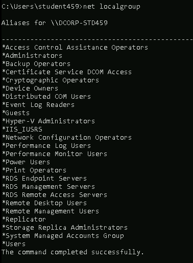

# CMD Commands

Here I will compile some CMD commands to enumerate local and domain accounts.

Ok, we have a low-level user and we want to enumerate our machine and AD, first, we need to understand who we are inside the machine and what type of privileges we have.

### Local Users & Groups

#### Who We Are?

```
C:\Users\student459>whoami
```

<figure><figcaption></figcaption></figure>

#### What groups we are associated with?

```batch
C:\Users\student459>net localgroup
```

<figure><figcaption></figcaption></figure>

#### Enumerate Local Users

```batch
C:\Users\student459> net user
```

<figure><figcaption></figcaption></figure>

#### Enumerate Local Administrator Account

```batch
C:\Users\student459>net user Administrator
```

<figure><figcaption></figcaption></figure>

### Local Services Running

#### Enumerate Local Services Running as System

```batch
TASKLIST /FI "USERNAME eq NT AUTHORITY\SYSTEM"
```

<figure><figcaption></figcaption></figure>

### Local Machine Information

```
C:\Users\student459>
```

### Local Network Shares

```
C:\Users\student459> net view \\dcorp-std459 /all
```

<figure><figcaption></figcaption></figure>

