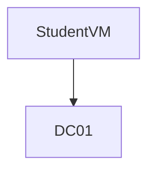

# 🤣 Escape the Machine

### Disable Firewall

Disable the firewall or add a rule allowing your reverse shell ports.

```
// Some code
```

### Bypassing PowerShell Security

#### With non-admin privileges:

```
RunWithRegistryNonAdmin.bat
```

Type exit from the new PowerShell session to complete the clean-up.



